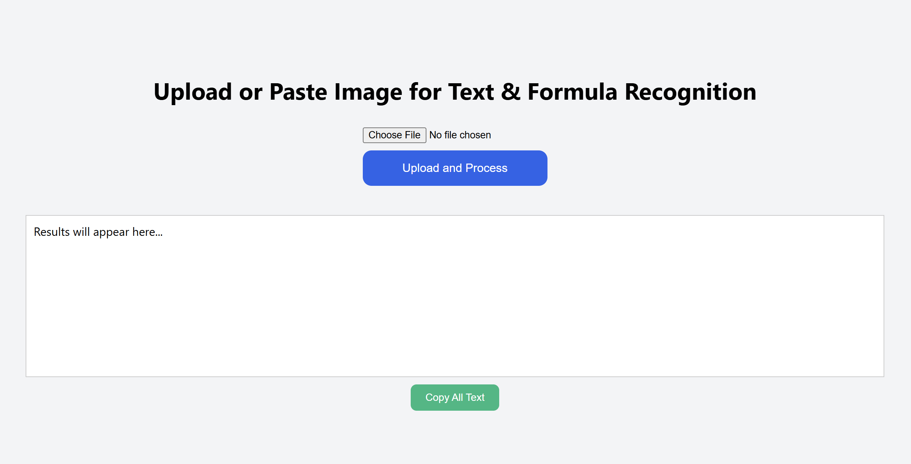

# Pix2Text Local Web UI

This project provides a **local** web interface for the `pix2text` package, enabling users to upload or paste images of text and equations (like scientific papers) and convert them into Markdown/LaTeX.



## Features
- Upload images or paste them directly.
- Extract text and equations using the `pix2text` model.
- Display the recognized text in a scrollable box.
- Copy the extracted text with a single click.

## Installation

### Step 1: Install Python
Make sure you have Python 3.10 or later installed. You can download it from [https://www.python.org/downloads/](https://www.python.org/downloads/).

To check if Python is installed, run:
```bash
python --version
```

### Step 2: Clone the Repository
```bash
git clone https://github.com/Cyh1368/pix2text-web-ui.git
cd pix2text-web-ui
```

### Step 3: Set Up a Virtual Environment (Optional)
```bash
python -m venv venv
source venv/bin/activate  # For Windows use: venv\Scripts\activate
```

### Step 4: Install Dependencies
```bash
pip install pix2text Flask Pillow
```

### Step 5: Run the Application
```bash
python pix2text_web.py
```

## Requirements

Install with:

```bash
pip install Flask Pillow pix2text
```

## Usage

```bash
python pix2text_web.py
```

Then open a browser and go to: [http://localhost:5000](http://localhost:5000)

## Example
When you visit the interface, you can:
1. Click to upload an image.
2. Paste an image directly into the browser.
3. View the extracted text.
4. Copy the text to your clipboard.

## License
[MIT License](LICENSE)

## Troubleshooting
- If CUDA errors occur, ensure `onnxruntime-gpu` is installed or force CPU mode as shown in the code.
- Check the browser console if pasting doesn’t work.
